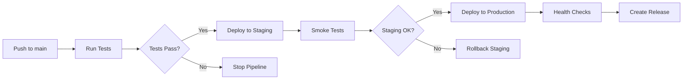

# CI/CD & Monitoring Setup Guide

## 📋 Overview

This document outlines the complete CI/CD and monitoring infrastructure for the Company of One project. The setup includes automated testing, deployment pipelines, security scanning, and comprehensive monitoring with alerting.

## 🏗️ CI/CD Architecture

### GitHub Actions Workflows

1. **Test Workflow** (`.github/workflows/test.yml`)
   - Runs on: Push to `main`/`develop`, Pull requests
   - **Jobs:**
     - Linting & Type checking
     - Frontend tests with coverage
     - Backend tests with coverage
     - E2E tests with Playwright
     - Coverage reporting to Codecov

2. **Security Workflow** (`.github/workflows/security.yml`)
   - Runs on: Push, PR, Daily at 2 AM UTC
   - **Jobs:**
     - Dependency vulnerability scanning
     - Code security analysis (CodeQL)
     - Secrets scanning (TruffleHog)
     - License compliance checking

3. **Deploy Workflow** (`.github/workflows/deploy.yml`)
   - Runs on: Push to `main` (after tests pass)
   - **Jobs:**
     - Staging deployment with smoke tests
     - Production deployment with health checks
     - Automatic release creation
     - Deployment notifications

### Deployment Strategy



## 🎯 Monitoring Architecture

### Stack Components

- **Prometheus**: Metrics collection and alerting
- **Grafana**: Visualization and dashboards
- **Alertmanager**: Alert routing and notifications
- **Blackbox Exporter**: External service monitoring
- **Node Exporter**: System metrics
- **cAdvisor**: Container metrics

### Monitoring Targets

1. **Application Metrics**
   - Frontend performance and availability
   - Backend API response times and errors
   - Memory usage and CPU utilization
   - Custom business metrics

2. **Infrastructure Metrics**
   - Server resource utilization
   - Container performance
   - Network connectivity
   - Disk space and I/O

3. **External Service Monitoring**
   - Third-party API availability
   - CDN performance
   - Database connectivity

## 🚀 Quick Start

### Prerequisites

- Docker and Docker Compose
- Node.js 20+
- Git
- GitHub repository access

### Required Secrets

Configure these secrets in your GitHub repository:

```bash
# Vercel Deployment
VERCEL_TOKEN=your_vercel_token
VERCEL_ORG_ID=your_org_id
VERCEL_PROJECT_ID_FRONTEND=frontend_project_id
VERCEL_PROJECT_ID_BACKEND=backend_project_id

# Environment URLs
STAGING_API_URL=https://your-staging-api.vercel.app
PRODUCTION_API_URL=https://your-prod-api.vercel.app
STAGING_DATABASE_URL=your_staging_db_url
PRODUCTION_DATABASE_URL=your_prod_db_url

# Monitoring (optional)
SLACK_WEBHOOK_URL=your_slack_webhook
PAGERDUTY_ROUTING_KEY=your_pagerduty_key
```

### Local Development Setup

1. **Install Dependencies**
   ```bash
   npm run install:all
   ```

2. **Run Tests**
   ```bash
   npm run test:all
   npm run test:e2e
   ```

3. **Start Monitoring Stack**
   ```bash
   docker-compose -f docker-compose.monitoring.yml up -d
   ```

4. **Access Monitoring Dashboards**
   - Prometheus: http://localhost:9090
   - Grafana: http://localhost:3001 (admin/admin123)
   - Alertmanager: http://localhost:9093

## 📊 Monitoring Endpoints

### Health Check Endpoints

- `GET /health` - Basic health status
- `GET /health/detailed` - Detailed metrics and system info
- `GET /health/ready` - Readiness probe for orchestration
- `GET /health/live` - Liveness probe for orchestration
- `GET /health/metrics` - Prometheus metrics format

### Sample Health Response

```json
{
  "status": "healthy",
  "message": "Company of One API is running",
  "timestamp": "2024-01-20T10:30:00.000Z",
  "uptime": 3600,
  "environment": "production",
  "version": "1.0.0"
}
```

## 🚨 Alerting Rules

### Critical Alerts

- **ServiceDown**: Service unavailable for 5+ minutes
- **CriticalMemoryUsage**: Memory usage > 95%
- **DiskSpaceCritical**: Disk space < 10%
- **DeploymentFailed**: Deployment process failed

### Warning Alerts

- **HighMemoryUsage**: Memory usage > 80%
- **HighCPUUsage**: CPU usage > 80%
- **HighResponseTime**: 95th percentile > 2 seconds
- **HighErrorRate**: Error rate > 10%

### Notification Channels

1. **Email**: Admin and team notifications
2. **Slack**: Real-time alerts with severity levels
3. **PagerDuty**: Critical service down alerts
4. **Webhook**: Integration with custom systems

## 🔧 Configuration

### Environment-Specific Settings

```yaml
# staging.yml
monitoring:
  retention: "7d"
  scrape_interval: "30s"
  alert_threshold: "relaxed"

# production.yml
monitoring:
  retention: "30d"
  scrape_interval: "15s"
  alert_threshold: "strict"
```

### Custom Metrics

Add custom application metrics:

```typescript
// Example: Custom business metric
const registerSale = () => {
  salesCounter.inc();
  revenueGauge.set(getTotalRevenue());
};
```

## 📈 Dashboards

### Pre-configured Dashboards

1. **Application Overview**
   - Request rate and response times
   - Error rates and status codes
   - Active users and sessions

2. **Infrastructure Health**
   - CPU, memory, and disk usage
   - Network traffic and latency
   - Container resource utilization

3. **Business Metrics**
   - User engagement metrics
   - Conversion rates
   - Revenue tracking

4. **Security Dashboard**
   - Failed login attempts
   - Suspicious activity alerts
   - Vulnerability scan results

## 🛠️ Maintenance

### Daily Tasks

- Review overnight alerts
- Check deployment status
- Monitor error rates

### Weekly Tasks

- Review security scan results
- Update dashboard configurations
- Performance optimization review

### Monthly Tasks

- Update monitoring retention policies
- Review and update alerting thresholds
- Security audit and updates

## 🚨 Troubleshooting

### Common Issues

1. **High Memory Usage**
   ```bash
   # Check memory leaks
   kubectl top pods
   # Review application logs
   kubectl logs -f deployment/app
   ```

2. **Failed Deployments**
   ```bash
   # Check deployment status
   vercel --debug
   # Review GitHub Actions logs
   gh run list --limit 5
   ```

3. **Monitoring Issues**
   ```bash
   # Restart monitoring stack
   docker-compose -f docker-compose.monitoring.yml restart
   # Check Prometheus targets
   curl http://localhost:9090/api/v1/targets
   ```

### Recovery Procedures

1. **Rollback Deployment**
   ```bash
   vercel rollback [deployment-url]
   ```

2. **Scale Resources**
   ```bash
   # Increase Vercel function memory
   vercel env add FUNCTION_MEMORY 512mb
   ```

## 📞 Support

### Emergency Contacts

- **Production Issues**: admin@companyofone.ai
- **Security Issues**: security@companyofone.ai
- **Infrastructure**: devops@companyofone.ai

### Escalation Matrix

1. **Level 1**: Automated alerts and self-healing
2. **Level 2**: On-call engineer notification
3. **Level 3**: Manager and team lead escalation
4. **Level 4**: Executive and vendor support

## 📚 Additional Resources

- [Prometheus Documentation](https://prometheus.io/docs/)
- [Grafana Documentation](https://grafana.com/docs/)
- [Vercel Deployment Guide](https://vercel.com/docs)
- [GitHub Actions Reference](https://docs.github.com/en/actions)

---

**Last Updated**: January 2024  
**Version**: 1.0.0  
**Owner**: DevOps Team